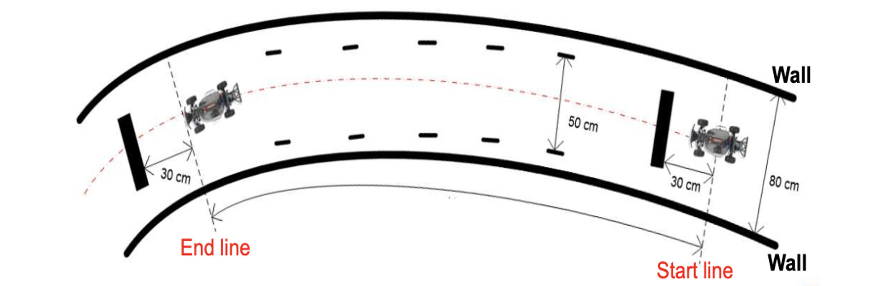

# Autonomous-Driving

In this project, An RC car to perform lane keeping and ACC (Adaptive Cruise Control) using two ultrasonic sensors with Kalman Filter and PID controller.

## Task 1
For this task, an RC car can be stop at the front of object with the distance 30 cm

## Task 2
For this task, an RC car can lane center keeping

* Use PD to control the steering
* Use PID to control the throttle

[Implementation](https://www.youtube.com/watch?v=sZxXla-JZuY)
